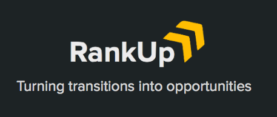
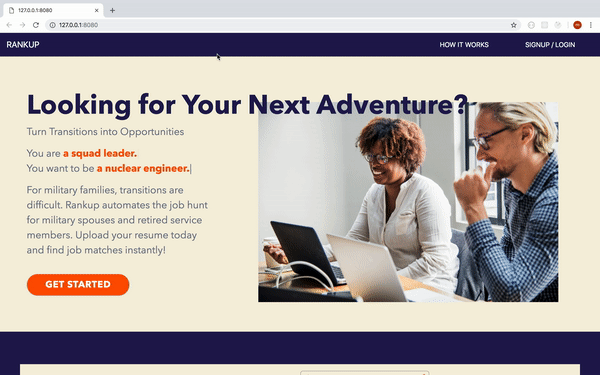
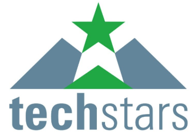
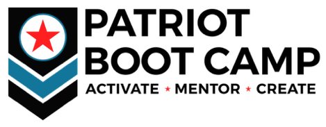

  

### Motivation
Military spouses often have to sacrifice long-term career goals in their support of their family and partners in the military. According to the Rand Corporation they are typically underemployed and underpaid much more than their civilian counterparts.  

### Our Project
Using NLP to curate personalized lists of jobs for military spouses that are ranked by analyzing their resume. Furthermore, we offer recommendations for education resources and a "path of least resistance" to pivot one's career and maximize salary gain. 

**VetHacks Hackathon** - Seattle, WA - October 12-14, 2018
- 1st Place Overall
- Approached by TechStars for funding

### Links
- Presentation Slides: http://bit.ly/2QwErWZ
- GitHub: https://github.com/drunkONdata/RankUp

### Future Work
* Expand to veterans looking to rejoin the civilian workforce
* Expand recommendations for education resources to bridge skills gap for career pivots & greatest salary gain
* Model hyperparameter improvements for better ranked matches
* Add LinkedIn profile data for better comparisons
* Use Machine Learning to decode military jargon for most similar civilian keywords

### Sponsors

  
  
  
  
  

### MIT License
Copyright (c) 2018 RankUp

Permission is hereby granted, free of charge, to any person obtaining a copy
of this software and associated documentation files (the "Software"), to deal
in the Software without restriction, including without limitation the rights
to use, copy, modify, merge, publish, distribute, sublicense, and/or sell
copies of the Software, and to permit persons to whom the Software is
furnished to do so, subject to the following conditions:

The above copyright notice and this permission notice shall be included in all
copies or substantial portions of the Software.

THE SOFTWARE IS PROVIDED "AS IS", WITHOUT WARRANTY OF ANY KIND, EXPRESS OR
IMPLIED, INCLUDING BUT NOT LIMITED TO THE WARRANTIES OF MERCHANTABILITY,
FITNESS FOR A PARTICULAR PURPOSE AND NONINFRINGEMENT. IN NO EVENT SHALL THE
AUTHORS OR COPYRIGHT HOLDERS BE LIABLE FOR ANY CLAIM, DAMAGES OR OTHER
LIABILITY, WHETHER IN AN ACTION OF CONTRACT, TORT OR OTHERWISE, ARISING FROM,
OUT OF OR IN CONNECTION WITH THE SOFTWARE OR THE USE OR OTHER DEALINGS IN THE